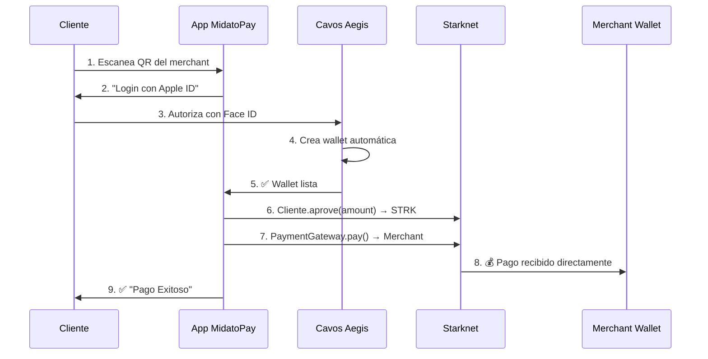

# 🏗️ ARQUITECTURA COMPLETA: MidatoPay + Cavos Aegis

## 📊 **DIAGRAMA ARQUITECTÓNICO**

```
┌─────────────────────────────────────────────────────────────────────┐
│                        🌐 MIDATOPAY ECOSYSTEM                       │
└─────────────────────────────────────────────────────────────────────┘

┌─────────────────────────────────────────────────────────────────────────┐
│ 📱 MOBILE APP (React Native + Expo)                                    │
│ ┌─────────────────────────────────────────────────────────────────────┐ │
│ │ 1. CLIENTE escanea QR                                              │ │
│ │ 2. App solicita: Apple ID / Google                                 │ │
│ │ 3. ✅ Cavos crea wallet automáticamente                           │ │
│ │ 4. 💳 Cliente autoriza pago (Face ID/Touch ID)                    │ │
│ │ 5. 🚀 Transacción enviada directamente a Starknet                  │ │
│ └─────────────────────────────────────────────────────────────────────┘ │
└─────────────────────────────────────────────────────────────────────────┘
                                        ↕️
┌─────────────────────────────────────────────────────────────────────────┐
│ 🌐 WEB DASHBOARD (Next.js + Cavos)                                     │
│ ┌─────────────────────────────────────────────────────────────────────┐ │
│ │ 1. MERCHANT loguea: Email/Password ó Apple ID                      │ │
│ │ 2. ✅ Cavos crea merchant wallet automáticamente                  │ │
│ │ 3. 📊 Dashboard muestra: saldos, transacciones                    │ │
│ │ 4. ➕ CREAR PAGO → genera QR                                       │ │
│ │ 5. 💰 Recibe pagos directamente en su wallet                       │ │
│ └─────────────────────────────────────────────────────────────────────┘ │
└─────────────────────────────────────────────────────────────────────────┘
                                        ↕️
┌─────────────────────────────────────────────────────────────────────────┐
│ ⚡ CAVOS AEGIS SDK (Infraestructura Invisible)                         │
│ ┌─────────────────────────────────────────────────────────────────────┐ │
│ │ 🔐 AUTENTICACIÓN: Auth0 + Social Login                             │ │
│ │ 🏦 WALLETS: Smart Accounts automáticas                             │ │
│ │ ⛽ GASLESS: Paymaster para transacciones sin gas                   │ │
│ │ 🔒 SEGURIDAD: Enterprise-grade                                      │ │
│ │ 📱 BIOMETRIC: Face ID / Touch ID                                   │ │
│ └─────────────────────────────────────────────────────────────────────┘ │
└─────────────────────────────────────────────────────────────────────────┘
                                        ↕️
┌─────────────────────────────────────────────────────────────────────────┐
│ 🔗 STARKNET BLOCKCHAIN (Sepolia Testnet → Mainnet)                     │
│ ┌─────────────────────────────────────────────────────────────────────┐ │
│ │ 📜 SMART CONTRACT 'PaymentGateway':                                  │ │
│ │   • Recibe pagos ERC-20 (USDT, BTC, ETH, STRK)                    │ │
│ │   • Previene double-spent con mapping                              │ │
│ │   • Emite eventos para backend                                     │ │
│ │ 🎯 RESULTADO: Pagos directos P2P sin intermediarios                │ │
│ └─────────────────────────────────────────────────────────────────────┘ │
└─────────────────────────────────────────────────────────────────────────┘
                                        ↕️
┌───────────────────────────────────────────────────────────┐
│ 🖥️ BACKEND MIDATOPAY (Node.js + Express)                 │
│ ┌─────────────────────────────────────────────────────┐ │
│ │ 📡 Escucha eventos del smart contract               │ │
│ │ 💾 Actualiza database (PostgreSQL + Prisma)        │ │
│ │ 🔄 WebSocket para updates en tiempo real           │ │
│ │ 📈 Analytics y métricas                            │ │
│ └─────────────────────────────────────────────────────┘ │
└───────────────────────────────────────────────────────────┘
```

## 🎯 **FLUJO PASO A PASO**

### **📱 FLUJO CLIENTE (Mobile)**



### **🌐 FLUJO MERCHANT (Web)**

```mermaid
sequenceDiagram
    participant M as Merchant
    participant D as Dashboard Web
    participant CA as Cavos Aegis
    participant B as Backend
    participant S as Starknet

    M->>D: 1. Login con Email/Password
    D->>CA: 2. Cavos.signIn()
    CA->>CA: 3. Crea smart account automática
    CA->>D: 4. ✅ Merchant wallet lista
    M->>D: 5. Crear pago: $5000 ARS → STRK
    D->>B: 6. Generar QR con datos
    B->>D: 7. QR con merchant_address + amount
    D->>M: 8. 📱 QR para cliente
    [Cliente paga...]
    S->>CA: 9. ✅ Evento de pago recibido
    CA->>D: 10. Dashboard actualizado en tiempo real
```

---

## 🏗️ **COMPONENTES TÉCNICOS**

### **📱 MIDATOPAY MOBILE (Expo)**

```
midatopay-mobile/
├── App.tsx                    # AegisProvider + Wallet UI
├── package.json              # @cavos/aegis + expo-web-browser
└── app.json                  # Deep linking config
```

**Función**: 
- App React Native con Expo
- Login social (Apple ID / Google)  
- Wallet management invisible al usuario
- UI nativa con colores MidatoPay 🇦🇷

### **🌐 MIDATOPAY WEB (Next.js)**

```
frontend/
├── src/app/layout.tsx        # AegisProvider configurado
├── src/app/auth/login/       # Login con opciones sociales
├── src/app/dashboard/        # CRM para merchants
├── cavos.config.ts          # Configuración centralizada
└── @cavos/aegis            # SDK instalado
```

**Función**:
- Dashboard profesional para merchants
- Login simplificado (Email ó Social)
- Gestión de pagos y analytics
- UI responsive con tema MidatoPay

### **⚡ CAVOS AEGIS SDK**

```
Función: Infraestructura "invisible"
• 🏦 Smart Accounts automáticas
• 🔐 Auth0 + Social Login
• ⛽ Gasless transactions
• 🔒 Enterprise security
• 📱 Biometric authentication
```

**Configuración**:
```typescript
AegisProvider({
  appId: 'app-a5b17a105d604090e051a297a8fad33d',
  network: 'sepolia',
  paymasterApiKey: 'opcional-para-gasless'
})
```

### **🔗 STARKNET SMART CONTRACT**

```
backend/
├── starknet/
│   ├── src/payment_gateway.cairo
│   ├── scripts/deploy.js
│   └── config.env
```

**Función**:
- Recibe pagos ERC-20 directamente
- Previene double-spent
- Emite eventos para escucha
- P2P sin intermediarios

### **🖥️ BACKEND MIDATOPAY**

```
backend/
├── src/
│   ├── services/starknet.js    # Escucha eventos blockchain
│   ├── routes/payments.js     # API endpoints
│   └── prisma/schema.prisma   # Database schema
```

**Función**:
- Escucha eventos del smart contract
- Actualiza PostgreSQL en tiempo real
- WebSocket para dashboard live updates
- Analytics y métricas

---

## 🚀 **VENTAJAS COMPETITIVAS**

### **🎯 PARA MERCHANTS**
| Aspecto | MidatoPay Actual | Con Cavos Aegis |
|---------|------------------|-----------------|
| **Setup** | Instalar wallet + configurar | Login con email ¡listo! |
| **Tiempo** | 15-20 minutos | 2 minutos |
| **Soporte** | Tutorial de crypto | UX familiar |
| **Adopción** | 5% usuario crypto | 95% usuarios normales |

### **📱 PARA CLIENTES**
| Aspecto | App Crypto Típica | MidatoPay + Cavos |
|---------|------------------|-------------------|
| **Onboarding** | Seed phrase + backups | Apple ID login |
| **Seguridad** | Claves privadas personales | Enterprise Auth0 |
| **UX** | Complicado técnico | Familiar móvil |
| **Pagos** | Cliente paga gas | Transacciones gasless |

### **💰 PARA EL NEGOCIO**
- **Escalabilidad**: Sin soporte técnico para wallets
- **Adopción masiva**: UX como PayPal/Stripe  
- **Competitivo**: Primera pasarela crypto UX Web2 en Argentina
- **Revenue**: Comisiones sin perder usuarios por fricción técnica

---

## 🎯 **ROADMAP VISUAL**

### **💻 MVP ACTUAL (Ya funciona)**
```
✅ Dashboard web con mock data
✅ QR generation para pagos  
✅ Payment success pages
✅ Login/Register tradicional
✅ Smart contract deployado
✅ Base de datos funcionando
```

### **🚀 V1.0 CON CAVOS (En desarrollo)**
```
🔄 Mobile app con Cavos Aegis
🔄 Login social (Apple/Google) 
🔄 Gasless transactions
🔄 Smart accounts automáticas
```

### **📈 V2.0 PRODUCCIÓN (Q1 2024)**
```
🔮 Deploy mainnet Starknet
🔮 Paymaster configurado
🔮 Analytics avanzadas
🔮 Onboarding automático
```

---

## 🏆 **POSICIONAMIENTO ÚNICO**

### **❌ Competencia Actual**:
- **Buenbit Pay**: Requiere conocimientos crypto
- **Ripio Pay**: UX técnica, gas fees
- **Crypto.com**: Internacional, no local argentino

### **✅ MidatoPay + Cavos**:
- 🇦🇷 **Argentino**: Pesos ARS como base
- 🚀 **Innovador**: Primera pasarela UX Web2 + infraestructura Web3
- 👥 **Masivo**: Sin barreras técnicas para adopción
- 💡 **Estratégico**: Partner con Cavos para tecnología de punta

---

## 🎯 **PROPUESTA DE VALOR AL INVERSOR**

### **🏗️ Tecnología Disruptiva**
- **Cavos Partnership**: Infraestructura cripto invisible nivel enterprise
- **Starknet First Mover**: Primera pasarela Argentina en Layer 2 de Ethereum
- **Mobile-First**: App nativa optimizada para mercado argentino

### **📊 Mercado Addressable**
- **Target**: Comercios ARS + clientes que quieren pagar con crypto
- **Pénétration**: Eliminar 95% de fricción técnica para adopción crypto
- **Escala**: Tecnología permite crecimiento sin límites técnicos

### **🎯 Tracción Esperada**
- **Merchants**: Onboarding 10x más rápido vs competencia
- **Consumer**: UX familiar elimina curva aprendizaje crypto
- **Revenue**: Comisiones sostenibles sin perder volumen por fricción

---

**🔥 CONCLUSION**: MidatoPay con Cavos Aegis = PayPal del crypto en Argentina 🇦🇷✨
